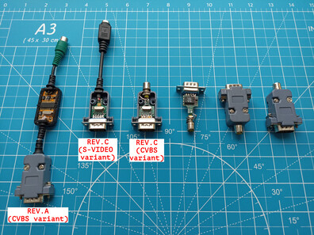

## RGB2SVIDEO

This device converts 15KHz RGB + Sync analog video signal to S-Video or CVBS (composite) signal.
Both PAL and NTSC are supported (you should choose one at build).

### Revision C PCB
This PCB is based on AD724 chip and designed to fit into DSUB shell.

[release/pcb.rev.C.pdf](release/pcb.rev.C.pdf?raw=true) - schematic and bill of materials  
[release/bom_interactive.rev.C.html](https://htmlpreview.github.io/?https://github.com/UzixLS/rgb2svideo/blob/master/release/bom_interactive.rev.C.html) - interactive BOM  
[release/gerber.rev.C.zip](release/gerber.rev.C.zip) - fabrication files  

### Revision A PCB
This PCB is based on BH7236AF/KA2198BD/CXA1645/CXA2075 chips and designed to fit into AK-S-71 shell.

[release/pcb.rev.A2.pdf](release/pcb.rev.A2.pdf?raw=true) - schematic and bill of materials  
[release/bom_interactive.rev.A2.html](https://htmlpreview.github.io/?https://github.com/UzixLS/rgb2svideo/blob/master/release/bom_interactive.rev.A2.html) - interactive BOM  
[release/gerber.rev.A2.zip](release/gerber.rev.A2.zip) - fabrication files  
